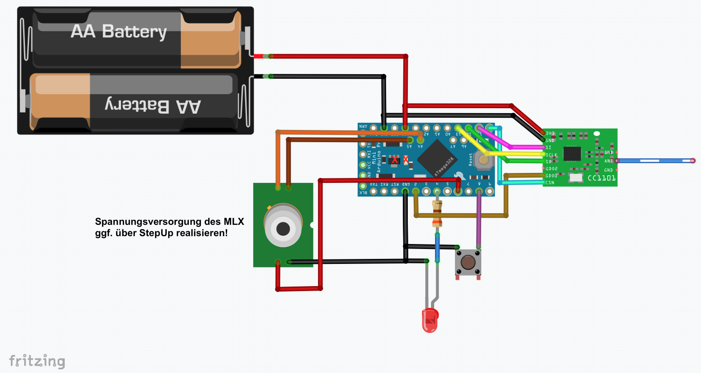
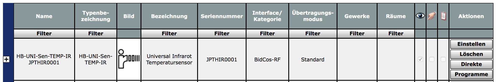
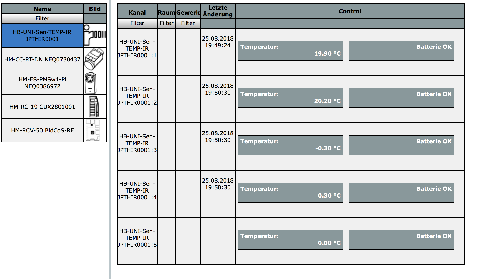

# HB-UNI-Sen-TEMP-IR
## Funk "MLX90614 Universal-Temperatursensor" für die Integration in HomeMatic

**Der Source-Code setzt mind. [Addon Version V1.14](https://github.com/jp112sdl/JP-HB-Devices-addon) oder höher voraus!**
 
## Verdrahtung:

## benötigte Hardware
* 1x Arduino Pro Mini **ATmega328P (3.3V / 8MHz)**
* 1x CC1101 Funkmodul **(868 MHz)**
* 1x FTDI Adapter (wird nur zum Flashen benötigt)
* 1x Taster (beliebig... irgendwas, das beim Draufdrücken schließt :smiley:)
* 1x LED 
* 1x Widerstand 330 Ohm
* 1x MLX90614 (GY-906) Infrarot Temperatursensor
* Draht, um die Komponenten zu verbinden

Um die Batterielebensdauer zu erhöhen, ist es unbedingt notwendig, die grüne LED sowie den LDO vom Arduino Pro Mini (die 2 roten X auf dem Schaltplan) abzulöten, oder mit einem kleinen Schraubendreher oder Messer von der Platine zu entfernen. Unbedingt aufpassen, dass keine Leiterbahnen zerstört werden.

## Universalplatine
Wer eine eigene Platine herstellen möchte, kann auf eine Auswahl verschiedener vorgefertigter Layouts zurückgreifen.
z.B.:
- [PCB](https://github.com/alexreinert/PCB) von alexreinert
- [HMSensor](https://github.com/pa-pa/HMSensor) von pa-pa

## Code flashen
- [AskSinPP Library](https://github.com/pa-pa/AskSinPP) in der Arduino IDE installieren
  - Achtung: Die Lib benötigt selbst auch noch weitere Bibliotheken, siehe [README](https://github.com/pa-pa/AskSinPP#required-additional-arduino-libraries).
- [Projekt-Datei](https://github.com/jp112sdl/HB-UNI-Sen-TEMP-IR/blob/master/HB-UNI-Sen-TEMP-IR.ino) herunterladen.
- Arduino IDE öffnen
  - Heruntergeladene Projekt-Datei öffnen
  - Werkzeuge
    - Board: Arduino Pro or Pro Mini
    - Prozessor: ATmega328P (3.3V 8MHz) 
    - Port: entsprechend FTDI Adapter
einstellen
- Menü "Sketch" -> "Hochladen" auswählen.

## Addon installieren
Um die Geräteunterstützung zu aktivieren, wird die aktuellste Version des [JP-HB-Devices Addon](https://github.com/jp112sdl/JP-HB-Devices-addon/releases/latest) benötigt!

## Gerät anlernen
Wenn alles korrekt verkabelt und das Addons installiert ist, kann das Gerät angelernt werden. 
Über den Button "Gerät anlernen" in der WebUI öffnet sich der Anlerndialog. 
Button "HM Gerät anlernen" startet den Anlernmodus. 
Nun ist der Taster (an Pin D8) kurz zu drücken. 
Die LED leuchtet für einen Moment. 
Anschließend ist das Gerät im Posteingang zu finden. 
Dort auf "Fertig" geklickt, wird es nun in der Geräteübersicht aufgeführt. 

## CCU-Ansicht:

